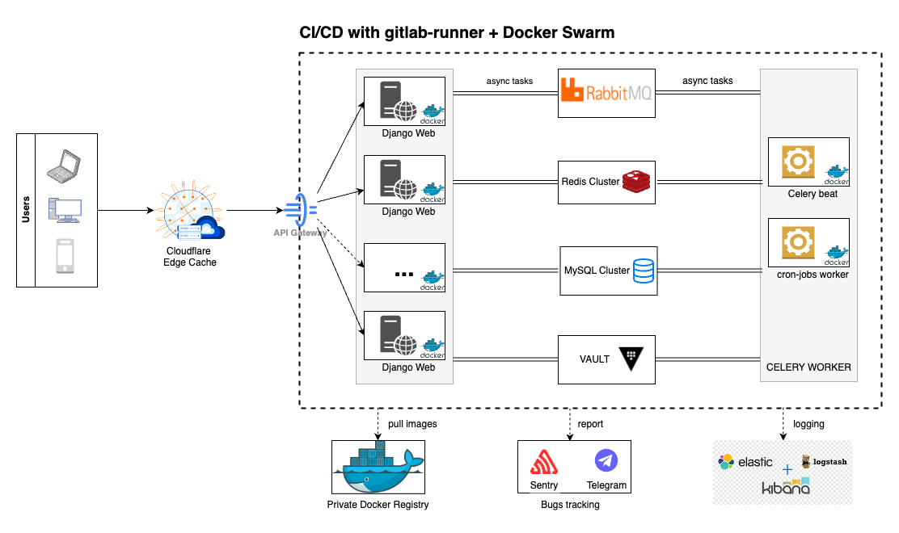
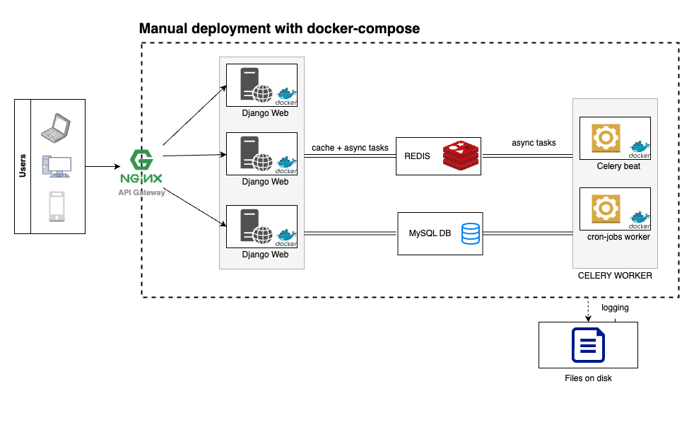
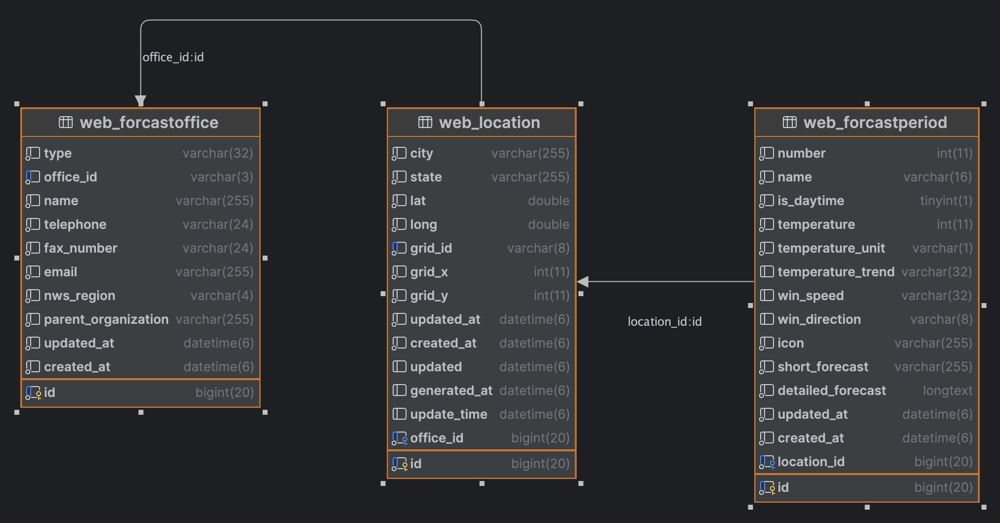
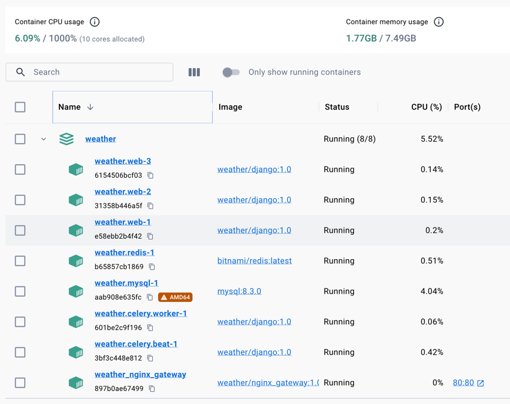
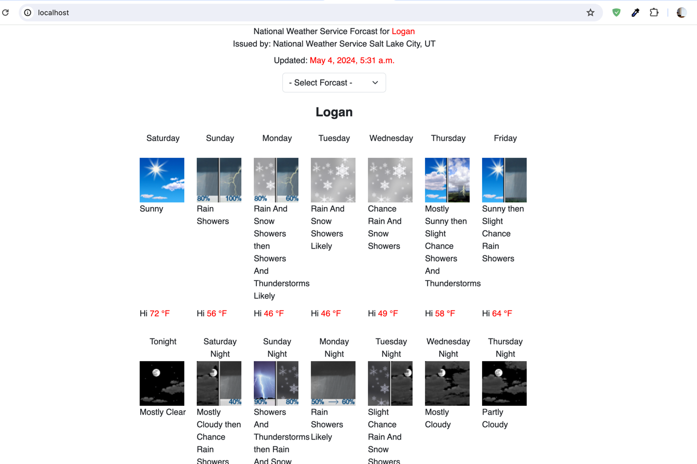

# Weather Monitoring project

| #    | NAME                                                        |
|------|-------------------------------------------------------------|
| 1    | [Architecture](#1architecture)                              |
| 1.1. | [Product architect](#11-product)                            |
| 1.2. | [Testing architect ](#12-testing)                           |
| 2    | [Database](#2-database)                                     |
| 3    | [Deploy testing environment](#3-deploy-testing-environment) |
| 4    | [For developer](#4-for-developer)                           |
[1. Assumptions.md](..%2F1.%20Assumptions.md)
# 1. Architecture

This is a simple tracking system with few components so we can consider to use Docker swarm instead of K8S for deployment.
Besides we also can consider just using a simple deployment by using docker-compose only.
Anyway it SHOULD be configured CI/CD with git/gitlab-runner.

We can update architecture by editing `docs/architecture.drawio` with [draw.io](https://draw.io/)

[1. Assumptions.md](..%2F1.%20Assumptions.md)
On application level, we use redis to cache user's request. The cache time will be 120s by default and we can change this time 
by update value of `INDEX_VIEW_CACHE_TIME` from environment.

There is a schedule worker that support to update information from [Weather Service](https://www.weather.gov/documentation/services-web-api).
We have two schedules:
* Update location's periods: Run every 30 minutes;
* Update location's grid point: Run one a day at 0:15am.

When user accesses index page and cache is expired, a task has been created to re-calculate periods of the request location.
So time of updating forcast data will be from 120s (`INDEX_VIEW_CACHE_TIME`) to 30m.

## 1.1. Product
For product environment, we have components, including:
* CDN: To cache user's request. We can use Cloudflare Edge Cache solution;
* API gateway: This could be Nginx to receive requests and distribute to `Django web` microservices;
* Django Web: It's main website that has been developed following microservice architecture and can be scaled easily;
* CELERY WORKER: It's scheduled tasks to re-calculate weather's data. It also contains workers that receive tasks 
directly from `Django Web` to calculate weather's data on demand;
* RabbitMQ: It's a message-broker to support scheduling;
* Redis Cluster: It's support caching to reduce requests directly to DB;
* MySQL Cluster: It's main database. Weather's data will be re-structured to be Relational DB;
* Vault: It contains secret information of DB, RabbitMQ, ...;
* Private Docker Registry: To contain built images like `Django web`, `CELERY WORKERS`, `Vault`, `MySQL`, `Redis`, `RabbitMQ`.
If we use AWS/Azure, we can consider to use some services from them for message-broker, database, cache, vault, logging;
* Bugs tracking:
  * Sentry: To handle un-expected exceptions and measure performance;
  * Telegram: To alert urgent problems then development team can handle them asap;
* Logging: Using ELK (Or CloudWatch) to record all logs.



## 1.2. Testing
Within the scope of this test, I recommend a simpler deployment method that can build and run on a single machine.
We will use docker-compose with all minimum necessary components for this system:
* Nginx: API gateway, LB;
* Django Web;
* Redis: support both cache and schedule for celery;
* MySQL: We also can use Sqlite;
* Logging: We will just output logs to files on disk.



# 2. Database

To support all requirements, we need to have these information:
* Office: It's unit that forcast weather. We can get this information by using  [office](https://www.weather.gov/documentation/services-web-api#/default/office) API;
* Location: It contains information from [Grid Point](https://www.weather.gov/documentation/services-web-api#/default/gridpoint) and [Point](https://www.weather.gov/documentation/services-web-api#/default/point);
For example, `Logan, UT` will be indicated as a location that has:
  * `geometry` data with lat & long to get `grid point` data;
  * `grid point` information to get `forcast` data;
  * `city` and `state`;
* Forcast Period: There are some types of forcast, including: 
  * forecast: forecast for 12h periods over the next seven days;
  * forecastHourly: forecast for hourly periods over the next seven days;
  * forecastGridData: raw forecast data over the next seven days.
  
We just extract only `forcast` data on this project because there is no extra requirements for other forcast data.
However, there is one unclear requirement that can select forcast. So I am thinking that we will allow users to change 
`location` to track the weather. Because it's unclear requirement, I just limit to calculate locations with same [Forcast zone](https://www.weather.gov/documentation/services-web-api#/default/zone_forecast)
of the target location (`Logan, UT`).

Following these specs, I create three main tables: 

There are other fields from API but currently this project does not require so I just try to support clear & necessary information.

# 3. Deploy testing environment
* Install [Docker](https://docs.docker.com/engine/install/) and [docker-compose](https://docs.docker.com/compose/);
* Open `terminal` and go to `weather` folder;
* Run these below commands, they will build and prepare these components:
  * weather.web: scale with 3 containers;
  * weather.redis;
  * weather.mysql;
  * weather.celery.beat;
  * weather.celery.worker;
  * weather.gateway.



```commandline
docker-compose build
docker-compose up -d --scale weather.web=3
```

* Wait few minutes, then open browser and access `locahost` or `127.0.0.1`, you can see similar result as 

# 4. For developer
## 4.1. Prepare working environment
* Prepare local dev environment with redis, MySQL (Or we can use SQLite) and update correct settings on .env from source folder;
* Create new environment for Python 3.11 (Python from 3.9 is also no problem) then install libraries. I guess that you 
are currently in source folder from a command line (or a terminal):

```commandline
pip install -r requirements.txt
```

* Open project on your IDE:
  * Configure newly created environment as Python Interpreter;
  * `source` folder as working directory.
* On command line (terminal) with activated environment, run this below command from `source` as root folder:

```commandline
python manage.py runserver 0.0.0.0:8000
```

* Open `localhost` or `127.0.0.1` on browser and start to develop or maintain features.

## 4.4. Run tests

```commandline
python manage.py test
```